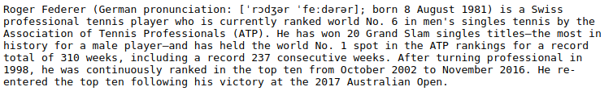
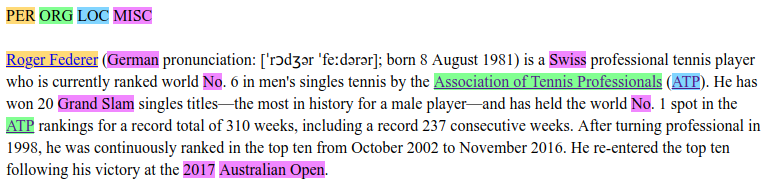

# Named Entity Recognizer (written in Keras)

This repository contains a Named Entity Recognizer written in Keras.

It takes as input a text:



And outputs an HTML page with the named entities highlighted and links to the corresponding Wikipedia pages:



The named entities are distributed among 4 classes: `PER` for "person", `LOC` for "location", `ORG` for "organization" and `MISC` for all the other named entities.

## How to use?

### Setup

You need to install the required libraries by executing the following command:

```
pip install -r requirements.txt
```

When the model will be trained, you might want to compare it to the NER in the library spaCy. Hence, you need to download the latter with:

```
python -m spacy download en_core_web_sm
```

### Building the vocabulary

CoNLL 2003 is the dataset used to train the model (located in `storage/conll2003`).

The first step is to build the vocabulary from the training set with:

```
python3 build_vocab.py
```

By default, it will associate the 90% most frequent words (after being lowercased) to unique IDs greater than 1. The other words will be mapped to ID 1. This is done to train the model on unknown words and hence reduce generalization error.

The ratio of 90% can be changed by adding the argument `--keep X` where `X` is a number between 0 and 1.

### Training the model

To train the model, execute the following command:

```
python3 train.py --model best --epochs 10
```

The model should reach 97% accuracy on test set and a **F1 score of 0.75.

### Using the model

Finally, here is the command to use the model to recognize named entities in a text:

```
python3 use.py --i-fname storage/texts/federer.txt --model best --wikipedia-link
```

## How it works?

### Preprocessing

A raw CoNLL txt file is first converted into:
- a list of sentences of words,
- a list of sentences of labels.

Then, the list of sentences of words is converted into:
- a list of sentences of lowercased word IDs using the vocabulary,
- a list of sentences of word casing IDs.

And the list of sentences of labels is converted into a list of sentences of label IDs.

### Model architecture

Lowercased word IDs and casing IDs are embed separately. The embedding are concatenated and sent to a bidirectionnal LSTM. Finally, the output of the bi-LSTM is sent to a dense layer then a softmax to get a distribution over the labels.

## How I realised this project?

### References

Because I knew absolutely nothing about Named Entity Recognization, I started by reading the litterature.

First, I read the following survey pages / papers to get an overview of the state of the art:
- [NER: Milestone Models, Papers and Technologies](https://blog.paralleldots.com/data-science/named-entity-recognition-milestone-models-papers-and-technologies/) (sept. 2017)
- [NER with keras and tensorflow](https://towardsdatascience.com/named-entity-recognition-ner-meeting-industrys-requirement-by-applying-state-of-the-art-deep-698d2b3b4ede) (déc. 2018)
- [A Survey on Recent Advances in NER from Deep Learning models](http://aclweb.org/anthology/C18-1182) (2018)
- [A Survey on Deep Learning for NER](https://arxiv.org/pdf/1812.09449.pdf) (2018)
- [Classement des techniques](http://nlpprogress.com/english/named_entity_recognition.html)

I discovered the most used datasets (CoNLL 2003 or OntoNotes 5), metrics (F1 score) and technics. To get a better understanding of the later, I read additional papers:
- [BiLSTM + CRF](https://arxiv.org/pdf/1508.01991.pdf)
- [BiLSTM + CNN](https://arxiv.org/pdf/1511.08308.pdf)
- [BiLSTM + CNN + CRF](https://arxiv.org/pdf/1603.01354.pdf)
- [Residual Stack BiLSTM](https://arxiv.org/pdf/1706.07598.pdf)
- [ELMo](https://arxiv.org/pdf/1802.05365.pdf)

Finally, I read some practical tutorials:
- [Stanford NER](https://cs230-stanford.github.io/pytorch-nlp.html)
- NlpForHackers NER: [Partie 1](https://nlpforhackers.io/named-entity-extraction/), [Partie 2](https://nlpforhackers.io/training-ner-large-dataset/)

### What I tried

First, I tried several implementations of BiLSTM + CNN, but they were all consuming too much RAM for my computer. Hence, I decided to make the char-level embedding from hand-made features based on casing, instead of using a CNN.

Second, to get a good word-level embedding, I decided to try word2vec, FastText (full and simple english) and GloVe but they were all consuming too much RAM too. So I decided to make the embedding myself.

### What to improve

1. Getting better char-level embeddings by using CNNs for example.
2. Getting better word-level embeddings by using FastText for example (but not possible on my computer).
3. Adding a CRF layer on top of the Bi-LSTM instead of the current dense layer.